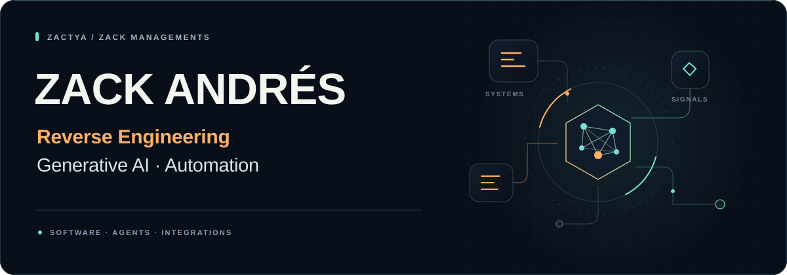
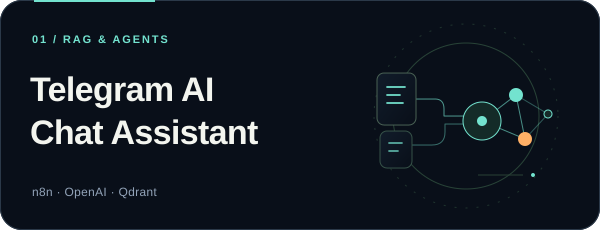
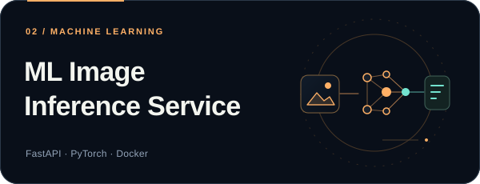

  

  <strong>Software engineer. Founder. Builder of connected systems.</strong> 
  6+ years building software · Zack Managements since 2020 · Spanish &amp; English

  
  &nbsp;
  

## From software internals to working systems

I'm **Andrés Sánchez**, also known as **Zack Andrés**. My core work combines **reverse engineering, C++ and Assembly** with **generative AI, agents and automation**.

I also specialize in **antidetect engineering for Android cloud phones**: device fingerprint analysis, device profiles and automation through ADB, AutoJS and cloud-phone APIs, including work with GeeLark and VMOS.

I build custom software around real operational needs: from agents that read a device screen and decide what to do next, to enterprise integrations, RPA workflows and dashboards. My background in **sales, operations and technical leadership** helps me connect engineering decisions with the people and businesses using those systems.

  
  
  
  
  
  

## Selected work · explore the code

<table>
  <tr>
    <td width="50%" valign="top">
      
      
A document-based Telegram assistant with vector retrieval, an n8n workflow, document ingestion and an Express setup dashboard.

      
<code>n8n</code> <code>OpenAI</code> <code>Qdrant</code> <code>Node.js</code>

      
<a href="https://github.com/Zactya/telegram-ai-chat-assistant"><strong>Explore the repository →</strong></a>

    </td>
    <td width="50%" valign="top">
      
      
An image classification API using pretrained ResNet18, with preprocessing, input validation, API tests, a web interface and Docker packaging.

      
<code>FastAPI</code> <code>PyTorch</code> <code>ResNet18</code> <code>Docker</code>

      
<a href="https://github.com/Zactya/ml-inference-service"><strong>Explore the repository →</strong></a>

    </td>
  </tr>
</table>

## Three connected areas of work

| Software internals & devices | AI & generative systems | Automation & integrations |
| --- | --- | --- |
| Reverse engineering, C++, Assembly, antidetect cloud phones, device fingerprints, ADB and device APIs. | AI agents, RAG assistants, transcription, image and video generation pipelines. | GoHighLevel, n8n, UiPath, APIs, event-driven systems and enterprise data flows. |

## Engineering with a business perspective

**Zack Managements** — founder and hands-on engineer. **Towa → Payless LATAM** — IT consulting and integration leadership. **Soru Agency** — operations management and technical delivery.

My commercial experience includes **sales closing at Omnidental**, **sales responsibility at Ecom Growth Partner** and **sales work with Golden Agency**. I bring that perspective into requirements, client communication and delivery.

<strong>View professional experience</strong>

### Zack Managements · Founder / Software & AI Engineer

**2020–present**

Custom software, AI agents, workflow automation, dashboards and integrations, with a specialization in antidetect Android cloud-phone environments and device fingerprint analysis. My work includes an agent that interprets device screens and chooses its next action, demonstrated across three cloud phones. I combine development with team coordination and delivery support.

### Towa Agency · IT Consultant, assigned to Payless LATAM

Integration Lead & Data Analyst work across VTEX, Retail Pro and SAP Business One. Hands-on contributions to Python integrations, AWS Lambda, REST APIs, RabbitMQ, data mappings, troubleshooting and integration test plans.

### Soru Agency · Operations Manager

**2023–2025**

Operations and project coordination in a B2B creative and technology agency, alongside Java backend, Angular, full-stack and DevOps work.

### Selected independent engagements

- **Pave Agency:** RPA and cloud-device automation.
- **Kaizen Internet SL:** an operations dashboard connected to GeeLark and automation workflows.

### Early freelance work

**2019–2022**

More than 20 landing pages and websites for international clients using React, HTML/CSS, WordPress and Webflow, alongside Python automation and scraping projects.

<strong>Explore the extended project portfolio</strong>

The repositories above are available for source review. This broader portfolio includes independent and personal work without a public source repository linked here; some client engagements are covered by NDA.

### AI & real-time applications

| Project | Scope | Stack |
| --- | --- | --- |
| Real-Time Transcriber | Live transcription and audio processing | Python, Whisper, WebSockets |
| AI Video Generation Pipeline | Video generation, prompt chaining and post-processing | WAN 2.2, Python, LangChain |
| Generative AI Chatbot Framework | Assistants with RAG, memory and tool integration | OpenAI, LangChain, FastAPI |
| AI Content Automation System | Content generation and publishing workflows | GPT-4, n8n, Python |

### Automation & data collection

| Project | Scope | Stack |
| --- | --- | --- |
| Social Media Account Automator | Multi-platform account and publishing workflows | Python, Selenium, Playwright |
| RPA Workflow Engine | Modular business process automation | UiPath, Python, n8n |
| Web Scraping Suite | Data collection, proxy management and recovery workflows | Python, Puppeteer, Redis |
| Mass Outreach Bot | Messaging and outreach workflow automation | Python, Selenium, RabbitMQ |

### Retail & analytics

| Project | Scope | Stack |
| --- | --- | --- |
| Retail Pro Data Analyzer | Sales reporting and KPI dashboards | Python, SQL, Power BI |
| VTEX Integration Middleware | VTEX / Retail Pro inventory integration | Node.js, REST APIs, PostgreSQL |
| ETL Pipeline — Retail Analytics | Retail data processing, anomaly detection and alerts | Python, RabbitMQ, PostgreSQL |
| Business Intelligence Dashboard | Executive reporting and analytics | Python, Pandas, Tableau |

### Web applications

| Project | Scope | Stack |
| --- | --- | --- |
| Zack Managements Platform | Business website, services and contact workflows | Next.js, Tailwind CSS, Vercel |
| Client Web Portfolio | 20+ landing pages and websites | React, HTML/CSS, WordPress, Webflow |
| SaaS Dashboard UI | Administration interface, RBAC and analytics | React, TypeScript, Tailwind CSS |
| E-commerce Storefront | Storefront, payments, inventory and analytics | Next.js, Stripe, PostgreSQL |

<strong>See the full technical toolkit</strong>

Tools used across different projects; the stack varies with the problem and engagement.

| Area | Technologies |
| --- | --- |
| Languages | C++, Assembly, C, Python, JavaScript, TypeScript, Java, Go, C#, SQL, Bash, Kotlin, Elixir |
| AI & ML | OpenAI, Claude, LangChain, RAG, Qdrant, PyTorch, torchvision, TensorFlow, Hugging Face, Whisper, WAN 2.2, Stable Diffusion |
| Automation & CRM | GoHighLevel, n8n, UiPath, Make, Zapier, Selenium, Playwright, Puppeteer, AutoHotkey |
| Antidetect & Android cloud phones | Device fingerprint analysis, device profiles, ADB, AutoJS, cloud-phone APIs, GeeLark, VMOS |
| Android development | Kotlin, Java, Jetpack Compose, MVVM, MVI |
| Frontend & design | React, Next.js, Angular, Vue, HTML/CSS, Tailwind CSS, Figma, WordPress, Webflow |
| Backend & APIs | Node.js, Express, NestJS, FastAPI, Django, Spring Boot, .NET, REST, GraphQL, WebSockets |
| Data platforms | PostgreSQL, MySQL, MongoDB, Redis, SQLite, Supabase, Oracle, Oracle APEX, PL/SQL, Snowflake, Databricks |
| Analytics | Pandas, NumPy, Jupyter, Power BI, Tableau, Excel, ETL |
| Cloud & delivery | AWS, AWS Lambda, Azure, Docker, Kubernetes, Terraform, Linux, Git, GitHub Actions, Vercel, Railway |
| Messaging & integrations | RabbitMQ, Kafka, VTEX, Retail Pro, SAP Business One, Salesforce, Magento, Stripe, Twilio, Telegram Bot API |
| Collaboration & development | Jira, Notion, Trello, Confluence, ClickUp, Asana, Cursor, Claude Code |

---

  <strong>Have a system to build or a technical problem to solve?</strong> 
  <a href="mailto:zack@zackmanagements.com">zack@zackmanagements.com</a> · <a href="https://zackmanagements.com">zackmanagements.com</a> 
  <a href="https://www.linkedin.com/in/andres-sanchez-26749643b/">LinkedIn</a> 
  Andrés Sánchez · Zack Andrés · Zack Managements

